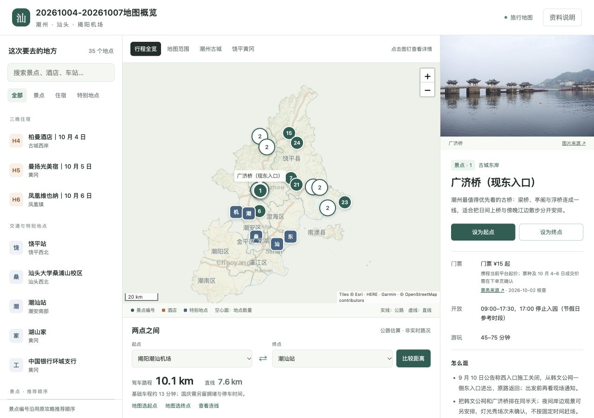

# 20261004-20261007地图概览

潮州、汕头与揭阳潮汕机场旅行地图，可查看地点资料并比较两点之间的距离。本仓库是公开网站发布包。

[打开公网地图](https://violetloveai.github.io/chaoshan-map-2026/)

网站由 GitHub Pages 托管，发布源为 `main` 分支根目录。无需构建，`.nojekyll` 保留在根目录；推送更新后由 Pages 自动发布。网站无需登录。访问体验取决于实际网络，不能以发布成功代替大陆网络实测。



预览中广济桥照片：Windmemories / Wikimedia Commons，[CC BY-SA 4.0](https://creativecommons.org/licenses/by-sa/4.0/)。其余图像署名见地图界面和对应地点详情。

## 地图内容

- 24 个景点、3 晚酒店、3 个车站、机场、2 个汕大校区、湖山家及环城支行，共 35 个固定地点。
- 地图显示潮州、汕头；揭阳只保留机场及连接区域。不包含潮安站。
- 比较固定地点或地图自选位置的直线距离，并查询驾车路程。陆地点之间已有距离表，在线接口不可用时仍可显示存档估算。
- 地点详情包含攻略、门票参考、开放时间、建议停留、来源与核查日期。湖山家为片区估点，未核实到门牌。
- 海岛及含渡船的路线不会标成全程驾车；偏离道路的选点会显示接驳偏差。

## 本地运行

在本目录运行：

```sh
python3 -m http.server 8785 --bind 127.0.0.1
```

打开 <http://127.0.0.1:8785/>。无需安装前端依赖。

`index.html` 为入口，`app.js` 负责界面，`core.js` 负责距离处理，`data/` 存放地点、边界与路线数据，`assets/` 存放 Leaflet 和照片。所有资源使用相对路径，支持站点子目录。

## 数据与联网

文字资料核查于 2026 年 10 月 2 日。票务、入校、船班及道路开放情况需在出发前确认。驾车时间来自静态路网，不含国庆实时拥堵、路桥费用或临时交通管制。

街道底图请求 Esri 服务，新路线请求 OSRM 公共服务；它们需要网络，可能限流或暂时不可用。请求路线时会向 OSRM 发送所选起终点坐标。固定资料、直线计算及已存距离可在本地离线使用。

## 图片及第三方许可

公网包只包含可确认开放许可的照片，并在详情中保留作者、来源及许可证。其余照片提供原始实景链接，未复制进本包。Leaflet 1.9.4 使用 BSD-2-Clause，许可见 `assets/vendor/leaflet-LICENSE.txt`。地图署名保留在界面内。

本站用于查看和分享，未为项目整体授予额外的再利用许可。网站及本仓库文件均公开。`robots.txt` 和 `noindex` 仅用于请求搜索引擎不收录，不是访问控制。
